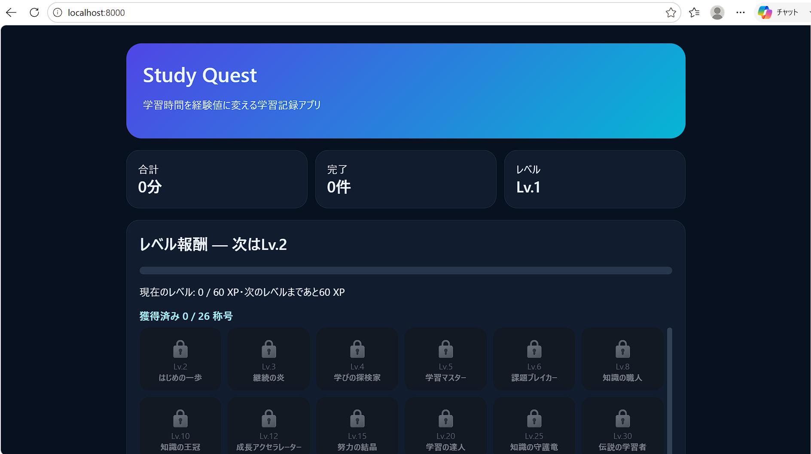

# Study Quest

学習時間を記録し、経験値・レベル・称号として可視化するWebアプリケーションです。Dockerコンテナ上で動作し、ホストPCのブラウザから利用できます。

## システムの概要

学習内容と学習時間を入力すると、学習時間1分を1 XPとして記録します。獲得XPに応じてレベルが上がり、一定のレベルに到達すると称号が解放されます。

- **入力**：学習内容、学習時間（分）
- **処理**：合計XP、現在レベル、次のレベルまでの必要XP、称号の計算
- **出力**：学習履歴、進捗バー、レベル、獲得称号の表示

## 用途

日々の勉強時間を記録し、ゲームのように成長を確認することで、学習を継続しやすくすることを目的としています。授業、資格試験、プログラミングなど、さまざまな学習の記録に利用できます。

## 主な機能

- 学習内容と時間の登録
- 学習履歴の一覧表示
- 完了・未完了の切替
- 不要な学習記録の削除
- 合計学習時間と完了件数の集計
- レベルが上がるほど必要XPが増えるレベル機能
- Lv.2からLv.100までの全26種類の称号
- 次のレベルまでのXPと進捗バーの表示
- SQLiteによる学習データの保存

## 使用技術

- Python
- Flask
- SQLite
- HTML / CSS
- Gunicorn
- Docker / Docker Compose

## 必要な環境

以下を事前にインストールしてください。

- Git
- Docker Desktop、またはDocker EngineとDocker Compose
- Webブラウザ

## 実行方法

### 1. リポジトリを取得する

```bash
git clone https://github.com/ユーザー名/study-quest.git
cd study-quest
```

`ユーザー名`は、公開したGitHubアカウント名に置き換えてください。

### 2. Dockerコンテナを起動する

```bash
docker compose up --build
```

初回起動時は、Dockerイメージの作成と必要なライブラリのインストールが行われるため、少し時間がかかる場合があります。

### 3. ブラウザからアクセスする

以下のURLを開きます。

```text
http://localhost:8000
```

サーバーの動作確認には、以下のURLを利用できます。

```text
http://localhost:8000/health
```

次の内容が表示されれば正常です。

```json
{"status":"ok"}
```

## 使い方

1. 「学習内容」に科目や作業名を入力します。
2. 「時間（分）」に学習時間を入力します。
3. 「追加」を押すと、学習記録とXPが追加されます。
4. 記録左側の丸ボタンで、完了・未完了を切り替えられます。
5. 不要な記録は「削除」から消せます。
6. XPが増えるとレベルが上がり、条件を満たした称号が解放されます。

## レベルと称号

次のレベルに必要なXPは、レベルが上がるごとに増加します。

- Lv.1からLv.2：60 XP
- Lv.2からLv.3：120 XP
- Lv.3からLv.4：180 XP
- 以降も60 XPずつ増加

称号はLv.2からLv.100までの節目で獲得できます。最終称号はLv.100の「究極の学習神」です。

## 動作画面



> アプリを起動して画面を撮影し、`docs/screenshot.png`という名前で保存してください。スクリーンショットを用意しない場合は、この節を削除してください。

## コンテナの停止

起動中のターミナルで `Ctrl+C` を押すか、別のターミナルで次を実行します。

```bash
docker compose down
```

保存データも含めて完全に初期化する場合は、次を実行します。

```bash
docker compose down -v
```

> `-v`を付けると、登録済みの学習記録も削除されるため注意してください。

## データの保存

学習記録はSQLiteに保存されます。Dockerボリュームを使用しているため、通常のコンテナ停止や再起動ではデータが保持されます。

## トラブルシューティング

### 8000番ポートが使用中の場合

`compose.yaml`のポート設定を次のように変更します。

```yaml
ports:
  - "8080:8000"
```

変更後は、次のURLへアクセスします。

```text
http://localhost:8080
```

### 更新内容が反映されない場合

```bash
docker compose down
docker compose up --build
```

### 初期状態からやり直す場合

```bash
docker compose down -v
docker compose up --build
```

## 生成AIの利用

アプリの企画、技術選定、Flaskコード、Dockerfile、Compose設定、UI、レベル計算、称号機能、デバッグ、READMEの作成に生成AIを利用しました。生成AIには、コード生成、エラー原因の調査、機能追加、画面改善、Docker設定などを指示しました。

## ファイル構成

```text
study-quest/
├── app.py
├── compose.yaml
├── Dockerfile
├── requirements.txt
├── README.md
├── docs/
│   └── screenshot.png
├── static/
│   └── style.css
└── templates/
    └── index.html
```

## ライセンス

このアプリは授業課題として作成したサンプルです。
